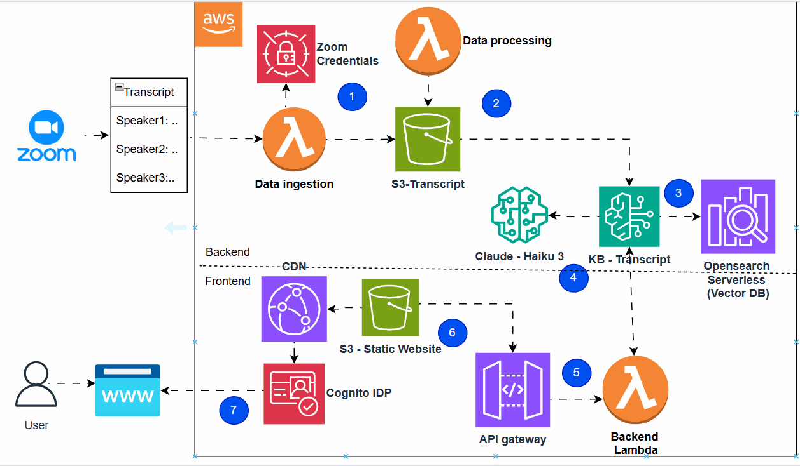

# 🎥 Zoom RAG Insight Engine

> **Elevator Pitch:** An AI-powered serverless RAG (Retrieval-Augmented Generation) application that automatically ingests Zoom meeting transcripts, indexes them into a vector database, and allows users to securely query meeting insights through a web frontend using Claude 3 Haiku.

---

## 💡 The Problem & Solution

* **The Problem:** Team meetings contain vast amounts of institutional knowledge, but searching through hours of audio transcripts manually to find specific decisions, action items, or context is highly inefficient.
* **Our Solution:** A completely serverless, automated pipeline that ingests Zoom transcripts instantly upon meeting completion, vectors the data using Amazon OpenSearch Serverless, and exposes a secure chat interface powered by Anthropic Claude 3 Haiku via Amazon Bedrock Knowledge Bases.

---

## 🏗️ System Architecture & Data Flow
This application is built entirely on a secure, serverless **AWS Architecture** divided into three main layers:


[ Zoom Meeting ] ──> [ Data Ingestion Lambda ] ──> [ S3-Transcript Bucket ]
│
▼
[ OpenSearch Serverless ] <──> [ Bedrock Knowledge Base (Claude 3 Haiku) ]
▲
│
[ User Browser ] ──> [ CloudFront CDN / Cognito ] ──> [ API Gateway ] ──> [ Backend Lambda ]


### End-to-End Data Pipeline:
1. **Ingestion (Step 1-2):** A dedicated **AWS Lambda (Data Ingestion)** securely retrieves credentials to pull meeting transcripts from the **Zoom API** in **VTT (Video Text Track) format**, passing the raw logs into an **Amazon S3 Bucket (`S3-Transcript`)**. Another Lambda handles downstream data processing. VTT format includes timestamped speaker information, making it ideal for preserving speaker context and timing metadata.
2. **Vectorization & Storage (Step 3):** The transcript text chunks are ingested by an **Amazon Bedrock Knowledge Base (KB - Transcript)**, converted into embeddings, and stored inside an **Amazon OpenSearch Serverless Vector Database**.
3. **RAG Orchestration (Step 4-5):** When a user asks a question, the request hits **Amazon API Gateway** and triggers the **Backend Lambda**, which queries the Bedrock Knowledge Base using **Claude 3 Haiku** to generate context-aware answers.
4. **Frontend Delivery (Step 6-7):** The user interacts with a static web app hosted on **Amazon S3**, optimized through a **CloudFront CDN**, and strictly secured using **Amazon Cognito IDP** for authentication.

---

## 🛠️ Tech Stack
* **Compute:** AWS Lambda (Serverless Node.js/Python)
* **Frontend Hosting:** Amazon S3 (Static Website Hosting) + Amazon CloudFront (CDN)
* **Auth & Security:** Amazon Cognito Identity Provider (IDP)
* **API Management:** Amazon API Gateway
* **AI & LLM:** Amazon Bedrock Knowledge Bases featuring **Anthropic Claude 3 Haiku**
* **Vector DB:** Amazon OpenSearch Serverless
* **Storage:** Amazon S3

---

## ✨ Core Features
* **Automated Zoom Ingestion:** Hands-free background syncing of multi-speaker transcripts right after a call ends.
* **Speaker-Aware Retrieval:** Intelligent indexing that preserves who said what (Speaker 1, Speaker 2, etc.) during queries.
* **Enterprise Security:** Complete user sign-in/sign-up flows via Cognito, isolating backend API routes securely.
* **Sub-Second RAG Answers:** Lightning-fast semantic search and response generation using the highly efficient Claude 3 Haiku model.

---

## 🚀 Getting Started

### Prerequisites
* An active **AWS Account** with permissions for Bedrock, OpenSearch Serverless, Lambda, and Cognito.
* **Zoom Marketplace App** credentials (JWT or OAuth) to access meeting transcripts.
* **AWS CLI** configured locally.

### Backend & Infrastructure Deployment (SAM / CloudFormation)

1. **Clone the repository:**
   ```bash
   git clone https://github.com/ragerumal/meeting_archieve_AI_Assistant.git
   cd meeting_archieve_AI_Assistant
   ```

2. **Configure Environment Variables:**
   Create a `.env` or reference an AWS Secrets Manager block containing your Zoom API configurations:
   ```env
   ZOOM_CLIENT_ID=your_zoom_client_id
   ZOOM_CLIENT_SECRET=your_zoom_client_secret
   OPENSEARCH_COLLECTION_ENDPOINT=your_opensearch_endpoint
   ```

3. **Deploy the Serverless Stack:**
   ```bash
   # Using AWS SAM to spin up the Lambdas, S3 buckets, and API Gateway
   sam build
   sam deploy --guided
   ```

### Frontend Deployment
1. Navigate to the frontend directory, install dependencies, and build the static assets:
   ```bash
   cd frontend
   npm install
   npm run build
   ```
2. Sync the build folder to your **S3 Static Website** bucket:
   ```bash
   aws s3 sync ./dist s3://your-s3-static-website-bucket-name --delete
   ```

---

## 📸 Demo & Screenshots

### Video Demo
- **Full System Walkthrough:** [View Demo Video](Hackathon%20intro%20-%205%20min%20demo%20for%20submission.mp4)

### Screenshots & Demos

**Web Frontend Interface:**


**System Architecture Diagram:**


---

## 🔧 Code Reference & Lambda Snippets

### Frontend Implementation

The frontend is a React-based single-page application that provides user authentication via Cognito and communicates with the backend Lambda through API Gateway.

#### Frontend Setup & Dependencies

```bash
# Create React app with TypeScript
npx create-react-app zoom-rag-frontend --template typescript
cd zoom-rag-frontend

# Install dependencies
npm install axios aws-amplify aws-amplify-react-auth zustand react-markdown
```

#### Cognito Authentication Configuration

```typescript
// src/config/awsConfig.ts
import { Amplify } from 'aws-amplify';

const awsConfig = {
  Auth: {
    region: 'us-east-1',
    userPoolId: process.env.REACT_APP_COGNITO_USER_POOL_ID,
    userPoolWebClientId: process.env.REACT_APP_COGNITO_CLIENT_ID,
    identityPoolId: process.env.REACT_APP_COGNITO_IDENTITY_POOL_ID,
    redirectSignIn: process.env.REACT_APP_COGNITO_REDIRECT_URI,
    redirectSignOut: process.env.REACT_APP_COGNITO_REDIRECT_URI
  },
  API: {
    endpoints: [
      {
        name: 'ZoomRAGAPI',
        endpoint: process.env.REACT_APP_API_GATEWAY_ENDPOINT,
        region: 'us-east-1'
      }
    ]
  }
};

Amplify.configure(awsConfig);
export default awsConfig;
```

#### API Service Layer

```typescript
// src/services/apiService.ts
import axios, { AxiosInstance } from 'axios';
import { Auth } from 'aws-amplify';

class APIService {
  private apiClient: AxiosInstance;
  private baseURL: string;

  constructor() {
    this.baseURL = process.env.REACT_APP_API_GATEWAY_ENDPOINT || '';
    this.apiClient = axios.create({
      baseURL: this.baseURL,
      timeout: 30000
    });

    // Add interceptor to include auth token
    this.apiClient.interceptors.request.use(async (config) => {
      try {
        const session = await Auth.currentSession();
        const token = session.getIdToken().getJwtToken();
        config.headers.Authorization = `Bearer ${token}`;
      } catch (error) {
        console.error('Error getting auth token:', error);
      }
      return config;
    });
  }

  /**
   * Query the RAG system with a user question
   * Calls the Backend Lambda through API Gateway
   */
  async queryRAG(userQuery: string, conversationId?: string): Promise<RAGResponse> {
    try {
      const response = await this.apiClient.post('/query', {
        user_query: userQuery,
        conversation_id: conversationId || generateConversationId()
      });

      return {
        success: true,
        query: userQuery,
        answer: response.data.answer,
        sources: response.data.sources || [],
        confidence: response.data.confidence || 0,
        timestamp: new Date().toISOString()
      };
    } catch (error: any) {
      console.error('Error querying RAG:', error);
      return {
        success: false,
        query: userQuery,
        answer: `Error: ${error.response?.data?.error || error.message}`,
        sources: [],
        confidence: 0,
        timestamp: new Date().toISOString()
      };
    }
  }

  /**
   * Fetch meeting transcripts metadata
   */
  async getMeetings(): Promise<Meeting[]> {
    try {
      const response = await this.apiClient.get('/meetings');
      return response.data.meetings || [];
    } catch (error) {
      console.error('Error fetching meetings:', error);
      return [];
    }
  }

  /**
   * Get specific meeting details and transcript
   */
  async getMeetingDetails(meetingId: string): Promise<Meeting | null> {
    try {
      const response = await this.apiClient.get(`/meetings/${meetingId}`);
      return response.data;
    } catch (error) {
      console.error(`Error fetching meeting ${meetingId}:`, error);
      return null;
    }
  }
}

interface RAGResponse {
  success: boolean;
  query: string;
  answer: string;
  sources: Array<{ document: string; location: string }>;
  confidence: number;
  timestamp: string;
}

interface Meeting {
  meeting_id: string;
  title: string;
  date: string;
  duration: number;
  participants: string[];
  transcript_url: string;
}

function generateConversationId(): string {
  return `conv_${Date.now()}_${Math.random().toString(36).substr(2, 9)}`;
}

export default new APIService();
```

#### React Component: Query Interface

```typescript
// src/components/RAGQueryInterface.tsx
import React, { useState, useRef, useEffect } from 'react';
import apiService, { RAGResponse } from '../services/apiService';
import './RAGQueryInterface.css';

interface Message {
  id: string;
  type: 'user' | 'assistant';
  content: string;
  timestamp: string;
  sources?: Array<{ document: string; location: string }>;
}

const RAGQueryInterface: React.FC = () => {
  const [messages, setMessages] = useState<Message[]>([]);
  const [inputQuery, setInputQuery] = useState('');
  const [loading, setLoading] = useState(false);
  const [conversationId, setConversationId] = useState('');
  const messagesEndRef = useRef<HTMLDivElement>(null);

  useEffect(() => {
    // Generate conversation ID on mount
    setConversationId(`conv_${Date.now()}_${Math.random().toString(36).substr(2, 9)}`);
  }, []);

  useEffect(() => {
    // Auto-scroll to bottom
    messagesEndRef.current?.scrollIntoView({ behavior: 'smooth' });
  }, [messages]);

  const handleSubmitQuery = async (e: React.FormEvent) => {
    e.preventDefault();

    if (!inputQuery.trim()) return;

    // Add user message to chat
    const userMessage: Message = {
      id: `msg_${Date.now()}`,
      type: 'user',
      content: inputQuery,
      timestamp: new Date().toISOString()
    };

    setMessages((prev) => [...prev, userMessage]);
    setInputQuery('');
    setLoading(true);

    try {
      // Call backend Lambda through API Gateway
      const response = await apiService.queryRAG(inputQuery, conversationId);

      // Add assistant response
      const assistantMessage: Message = {
        id: `msg_${Date.now()}_response`,
        type: 'assistant',
        content: response.answer,
        timestamp: response.timestamp,
        sources: response.sources
      };

      setMessages((prev) => [...prev, assistantMessage]);
    } catch (error) {
      console.error('Error in query:', error);
      const errorMessage: Message = {
        id: `msg_${Date.now()}_error`,
        type: 'assistant',
        content: 'Sorry, there was an error processing your query. Please try again.',
        timestamp: new Date().toISOString()
      };
      setMessages((prev) => [...prev, errorMessage]);
    } finally {
      setLoading(false);
    }
  };

  return (
    <div className="rag-query-container">
      <div className="chat-header">
        <h2>🤖 Zoom Meeting RAG Assistant</h2>
        <p>Ask questions about your Zoom meeting transcripts</p>
      </div>

      <div className="messages-container">
        {messages.length === 0 && (
          <div className="welcome-message">
            <h3>Welcome to Zoom RAG Insight Engine</h3>
            <p>Ask me anything about your meeting transcripts!</p>
            <ul className="example-queries">
              <li>What were the key action items discussed?</li>
              <li>Who was responsible for the budget review?</li>
              <li>What decisions were made about the project timeline?</li>
              <li>Summarize the main discussion points</li>
            </ul>
          </div>
        )}

        {messages.map((message) => (
          <div key={message.id} className={`message message-${message.type}`}>
            <div className="message-content">
              <p>{message.content}</p>
              {message.sources && message.sources.length > 0 && (
                <div className="sources">
                  <h4>📚 Sources:</h4>
                  <ul>
                    {message.sources.map((source, idx) => (
                      <li key={idx}>
                        <strong>{source.document}</strong>
                        <br />
                        <small>{source.location}</small>
                      </li>
                    ))}
                  </ul>
                </div>
              )}
            </div>
            <span className="timestamp">
              {new Date(message.timestamp).toLocaleTimeString()}
            </span>
          </div>
        ))}

        {loading && (
          <div className="message message-assistant loading">
            <div className="typing-indicator">
              <span></span>
              <span></span>
              <span></span>
            </div>
          </div>
        )}

        <div ref={messagesEndRef} />
      </div>

      <form onSubmit={handleSubmitQuery} className="query-form">
        <input
          type="text"
          value={inputQuery}
          onChange={(e) => setInputQuery(e.target.value)}
          placeholder="Ask a question about your meetings..."
          disabled={loading}
          className="query-input"
        />
        <button type="submit" disabled={loading} className="submit-button">
          {loading ? '⏳ Processing...' : '📤 Send'}
        </button>
      </form>
    </div>
  );
};

export default RAGQueryInterface;
```

#### CSS Styling

```css
/* src/components/RAGQueryInterface.css */
.rag-query-container {
  display: flex;
  flex-direction: column;
  height: 100vh;
  max-width: 1200px;
  margin: 0 auto;
  background: linear-gradient(135deg, #667eea 0%, #764ba2 100%);
  font-family: 'Segoe UI', Tahoma, Geneva, Verdana, sans-serif;
}

.chat-header {
  padding: 20px;
  background: rgba(0, 0, 0, 0.2);
  color: white;
  text-align: center;
  border-bottom: 2px solid rgba(255, 255, 255, 0.1);
}

.chat-header h2 {
  margin: 0 0 5px 0;
  font-size: 28px;
}

.chat-header p {
  margin: 0;
  font-size: 14px;
  opacity: 0.9;
}

.messages-container {
  flex: 1;
  overflow-y: auto;
  padding: 20px;
  display: flex;
  flex-direction: column;
  gap: 15px;
}

.welcome-message {
  text-align: center;
  color: white;
  padding: 40px 20px;
}

.welcome-message h3 {
  font-size: 24px;
  margin-bottom: 10px;
}

.welcome-message p {
  font-size: 16px;
  margin-bottom: 20px;
  opacity: 0.9;
}

.example-queries {
  list-style: none;
  padding: 0;
  margin: 0;
  display: flex;
  flex-direction: column;
  gap: 10px;
}

.example-queries li {
  background: rgba(255, 255, 255, 0.1);
  padding: 12px;
  border-radius: 8px;
  cursor: pointer;
  transition: all 0.3s ease;
}

.example-queries li:hover {
  background: rgba(255, 255, 255, 0.2);
  transform: translateX(5px);
}

.message {
  display: flex;
  flex-direction: column;
  max-width: 80%;
  padding: 12px 16px;
  border-radius: 12px;
  word-wrap: break-word;
  animation: slideIn 0.3s ease;
}

@keyframes slideIn {
  from {
    opacity: 0;
    transform: translateY(10px);
  }
  to {
    opacity: 1;
    transform: translateY(0);
  }
}

.message-user {
  align-self: flex-end;
  background: #667eea;
  color: white;
  border-radius: 12px 0 12px 12px;
}

.message-assistant {
  align-self: flex-start;
  background: white;
  color: #333;
  border-radius: 0 12px 12px 12px;
  box-shadow: 0 2px 8px rgba(0, 0, 0, 0.1);
}

.message-content p {
  margin: 0 0 10px 0;
  line-height: 1.5;
}

.sources {
  margin-top: 12px;
  padding-top: 12px;
  border-top: 1px solid #e0e0e0;
  font-size: 13px;
}

.sources h4 {
  margin: 0 0 8px 0;
  color: #667eea;
  font-size: 12px;
  text-transform: uppercase;
  letter-spacing: 0.5px;
}

.sources ul {
  list-style: none;
  padding: 0;
  margin: 0;
}

.sources li {
  margin-bottom: 8px;
  padding: 8px;
  background: #f5f5f5;
  border-left: 3px solid #667eea;
  border-radius: 4px;
}

.timestamp {
  font-size: 12px;
  opacity: 0.6;
  margin-top: 4px;
}

.query-form {
  display: flex;
  gap: 10px;
  padding: 20px;
  background: rgba(0, 0, 0, 0.1);
  border-top: 1px solid rgba(255, 255, 255, 0.1);
}

.query-input {
  flex: 1;
  padding: 12px 16px;
  border: none;
  border-radius: 24px;
  font-size: 14px;
  outline: none;
  background: white;
  box-shadow: 0 2px 8px rgba(0, 0, 0, 0.1);
}

.query-input:focus {
  box-shadow: 0 2px 12px rgba(102, 126, 234, 0.4);
}

.query-input:disabled {
  background: #f0f0f0;
  color: #999;
}

.submit-button {
  padding: 12px 24px;
  background: white;
  color: #667eea;
  border: none;
  border-radius: 24px;
  font-weight: 600;
  cursor: pointer;
  transition: all 0.3s ease;
  box-shadow: 0 2px 8px rgba(0, 0, 0, 0.1);
}

.submit-button:hover:not(:disabled) {
  transform: translateY(-2px);
  box-shadow: 0 4px 12px rgba(0, 0, 0, 0.15);
}

.submit-button:disabled {
  opacity: 0.6;
  cursor: not-allowed;
}

.loading {
  align-items: center;
}

.typing-indicator {
  display: flex;
  gap: 4px;
  align-items: center;
}

.typing-indicator span {
  width: 8px;
  height: 8px;
  border-radius: 50%;
  background: #667eea;
  animation: bounce 1.4s infinite;
}

.typing-indicator span:nth-child(2) {
  animation-delay: 0.2s;
}

.typing-indicator span:nth-child(3) {
  animation-delay: 0.4s;
}

@keyframes bounce {
  0%, 60%, 100% {
    transform: translateY(0);
    opacity: 0.6;
  }
  30% {
    transform: translateY(-10px);
    opacity: 1;
  }
}
```

#### Environment Variables (.env)

```env
# .env
REACT_APP_API_GATEWAY_ENDPOINT=https://your-api-id.execute-api.us-east-1.amazonaws.com/prod
REACT_APP_COGNITO_USER_POOL_ID=us-east-1_xxxxxxxxx
REACT_APP_COGNITO_CLIENT_ID=your_client_id_here
REACT_APP_COGNITO_IDENTITY_POOL_ID=us-east-1:xxxxxxxx-xxxx-xxxx-xxxx-xxxxxxxxxxxx
REACT_APP_COGNITO_REDIRECT_URI=http://localhost:3000
```

**Frontend Features:**
- ✅ Cognito authentication integration
- ✅ Real-time chat interface with backend Lambda
- ✅ Message history and conversation tracking
- ✅ Source citations from RAG responses
- ✅ Loading states and error handling
- ✅ Responsive UI with smooth animations
- ✅ Auto-scroll and timestamp tracking

---

### Data Ingestion Lambda

The following Lambda function handles Zoom meeting transcripts in **VTT (Video Text Track) format** retrieval and S3 storage. VTT format is the standard format returned by Zoom API for recorded meetings and includes timestamped speaker information:

```python
import json
import boto3
import requests
from datetime import datetime
import re
import os

s3 = boto3.client('s3')
secrets = boto3.client('secretsmanager')

def lambda_handler(event, context):
    """
    Fetches Zoom meeting transcripts in VTT format via Zoom API and stores them in S3.
    VTT (Video Text Track) format includes timestamped speaker information and dialogue.
    
    Event payload:
    {
        "meeting_id": "meeting_123",
        "timestamp": "2026-08-17T10:00:00Z"
    }
    """
    try:
        # Retrieve Zoom credentials from AWS Secrets Manager
        secret_response = secrets.get_secret_value(SecretId='zoom/api-credentials')
        zoom_creds = json.loads(secret_response['SecretString'])
        
        meeting_id = event.get('meeting_id')
        
        # Fetch transcript from Zoom API with VTT format
        zoom_url = f"https://api.zoom.us/v2/meetings/{meeting_id}/recordings"
        headers = {
            'Authorization': f'Bearer {get_zoom_token(zoom_creds)}',
            'Content-Type': 'application/json'
        }
        
        response = requests.get(zoom_url, headers=headers)
        recording_data = response.json()
        
        # Extract and validate VTT transcript
        if 'recording_files' not in recording_data:
            return {
                'statusCode': 404,
                'body': json.dumps('No recordings found for meeting')
            }
        
        # Find VTT file in recording files
        vtt_file = None
        for file in recording_data['recording_files']:
            if file.get('file_type') == 'VTT' or file.get('file_extension') == '.vtt':
                vtt_file = file
                break
        
        if not vtt_file:
            print("Warning: No VTT file found, attempting to fetch transcript from Zoom API")
            vtt_content = fetch_vtt_transcript(meeting_id, zoom_creds)
        else:
            # Download VTT file from Zoom
            vtt_content = download_vtt_file(vtt_file['download_url'], zoom_creds)
        
        # Validate VTT format
        validate_vtt_format(vtt_content)
        
        # Store raw VTT transcript in S3
        s3_key = f"transcripts/raw/{meeting_id}_{datetime.now().isoformat()}.vtt"
        s3.put_object(
            Bucket=os.environ['TRANSCRIPT_BUCKET'],
            Key=s3_key,
            Body=vtt_content,
            ContentType='text/vtt'
        )
        
        # Also store metadata JSON
        metadata = {
            'meeting_id': meeting_id,
            'file_type': 'VTT',
            'ingestion_timestamp': datetime.now().isoformat(),
            's3_location': s3_key,
            'duration': recording_data.get('duration'),
            'participants': recording_data.get('participant_count')
        }
        
        metadata_key = f"transcripts/metadata/{meeting_id}_{datetime.now().isoformat()}.json"
        s3.put_object(
            Bucket=os.environ['TRANSCRIPT_BUCKET'],
            Key=metadata_key,
            Body=json.dumps(metadata),
            ContentType='application/json'
        )
        
        print(f"VTT transcript stored at s3://{os.environ['TRANSCRIPT_BUCKET']}/{s3_key}")
        print(f"Metadata stored at s3://{os.environ['TRANSCRIPT_BUCKET']}/{metadata_key}")
        
        return {
            'statusCode': 200,
            'body': json.dumps({
                'message': 'VTT transcript ingested successfully',
                's3_vtt_location': s3_key,
                's3_metadata_location': metadata_key
            })
        }
        
    except Exception as e:
        print(f"Error in data ingestion: {str(e)}")
        return {
            'statusCode': 500,
            'body': json.dumps(f'Error: {str(e)}')
        }

def get_zoom_token(credentials):
    """Generate Zoom JWT token for API authentication."""
    import jwt
    import time
    
    payload = {
        'iss': credentials['client_id'],
        'exp': int(time.time()) + 3600
    }
    
    token = jwt.encode(payload, credentials['client_secret'], algorithm='HS256')
    return token

def download_vtt_file(download_url: str, zoom_creds: dict) -> str:
    """Download VTT file from Zoom with authentication."""
    headers = {
        'Authorization': f'Bearer {get_zoom_token(zoom_creds)}'
    }
    response = requests.get(download_url, headers=headers)
    return response.text

def fetch_vtt_transcript(meeting_id: str, zoom_creds: dict) -> str:
    """Fetch transcript from Zoom Cloud Recordings API and convert to VTT format."""
    zoom_url = f"https://api.zoom.us/v2/meetings/{meeting_id}/recordings/transcript"
    headers = {
        'Authorization': f'Bearer {get_zoom_token(zoom_creds)}',
        'Content-Type': 'application/json'
    }
    
    response = requests.get(zoom_url, headers=headers)
    transcript_data = response.json()
    
    # Convert transcript JSON to VTT format
    return convert_transcript_to_vtt(transcript_data)

def convert_transcript_to_vtt(transcript_data: dict) -> str:
    """Convert Zoom transcript JSON to VTT (Video Text Track) format."""
    vtt_content = "WEBVTT\n\n"
    
    messages = transcript_data.get('messages', [])
    for msg in messages:
        start_time = msg.get('start_time', '00:00:00')
        end_time = msg.get('end_time', '00:00:01')
        speaker = msg.get('speaker', 'Unknown Speaker')
        text = msg.get('text', '')
        
        # Format VTT cue
        vtt_content += f"{format_vtt_timestamp(start_time)} --> {format_vtt_timestamp(end_time)}\n"
        vtt_content += f"<v {speaker}> {text}\n\n"
    
    return vtt_content

def format_vtt_timestamp(timestamp: str) -> str:
    """Convert timestamp to VTT format (HH:MM:SS.mmm)."""
    if isinstance(timestamp, str):
        if 'T' in timestamp:  # ISO format
            time_part = timestamp.split('T')[1]
        else:
            time_part = timestamp
    
    # Ensure format is HH:MM:SS.mmm
    if '.' not in time_part:
        time_part += '.000'
    
    return time_part[:12]  # Trim to HH:MM:SS.mmm

def validate_vtt_format(vtt_content: str) -> bool:
    """Validate that the content follows VTT format specification."""
    if not vtt_content.startswith('WEBVTT'):
        raise ValueError("VTT file must start with 'WEBVTT' header")
    
    # Check for valid timestamp format
    timestamp_pattern = r'\d{2}:\d{2}:\d{2}\.\d{3} --> \d{2}:\d{2}:\d{2}\.\d{3}'
    if not re.search(timestamp_pattern, vtt_content):
        raise ValueError("VTT file does not contain valid timestamps")
    
    return True
```

**Environment Variables:**
- `TRANSCRIPT_BUCKET`: S3 bucket name for storing raw VTT transcripts
- Zoom credentials stored in AWS Secrets Manager

**VTT Format Details:**
The Lambda ingests and processes VTT files which follow the WebVTT specification:
- **Header**: Starts with `WEBVTT` keyword
- **Cues**: Each speaker segment includes timestamp range and speaker name
- **Timestamps**: Format `HH:MM:SS.mmm --> HH:MM:SS.mmm` (hours:minutes:seconds.milliseconds)
- **Speaker Tags**: `<v Speaker_Name>` to identify who spoke
- **Benefits**: Preserves temporal context, speaker identity, and enables precise segment retrieval

---

### Data Processing Lambda

This Lambda processes VTT transcript files, extracts speaker segments, cleans, chunks, and prepares them for vectorization:

```python
import json
import boto3
import re
from typing import List

s3 = boto3.client('s3')
bedrock = boto3.client('bedrock-runtime')

def lambda_handler(event, context):
    """
    Processes raw VTT transcripts: parsing, cleaning, chunking, and preparing for vectorization.
    Handles WebVTT format with speaker tags and timestamps.
    
    Event payload:
    {
        "s3_bucket": "transcript-bucket",
        "s3_key": "transcripts/raw/meeting_123.vtt"
    }
    """
    try:
        s3_bucket = event.get('s3_bucket')
        s3_key = event.get('s3_key')
        
        # Fetch raw VTT transcript from S3
        obj = s3.get_object(Bucket=s3_bucket, Key=s3_key)
        raw_vtt_content = obj['Body'].read().decode('utf-8')
        
        # Parse VTT format and extract speaker segments
        speaker_segments = parse_vtt_content(raw_vtt_content)
        
        # Extract and clean transcript text while preserving speaker metadata
        transcript_text = extract_transcript_text(speaker_segments)
        cleaned_text = clean_transcript(transcript_text)
        
        # Split into semantic chunks (max 1000 tokens per chunk)
        chunks = semantic_chunking(cleaned_text, chunk_size=1000, overlap=200)
        
        # Preserve speaker information and timestamps in chunks
        enriched_chunks = enrich_chunks_with_metadata(chunks, speaker_segments)
        
        # Store processed chunks for Bedrock KB ingestion
        processed_key = s3_key.replace('raw', 'processed').replace('.vtt', '.json')
        s3.put_object(
            Bucket=s3_bucket,
            Key=processed_key,
            Body=json.dumps(enriched_chunks),
            ContentType='application/json'
        )
        
        print(f"Processed {len(enriched_chunks)} chunks from VTT, stored at {processed_key}")
        
        return {
            'statusCode': 200,
            'body': json.dumps({
                'chunks_created': len(enriched_chunks),
                'processed_location': processed_key,
                'format_processed': 'VTT'
            })
        }
        
    except Exception as e:
        print(f"Error in data processing: {str(e)}")
        return {
            'statusCode': 500,
            'body': json.dumps(f'Processing failed: {str(e)}')
        }

def parse_vtt_content(vtt_content: str) -> List[dict]:
    """Parse WebVTT format content and extract speaker segments with timestamps."""
    segments = []
    lines = vtt_content.strip().split('\n')
    
    i = 0
    while i < len(lines):
        line = lines[i].strip()
        
        # Look for timestamp lines
        if '-->' in line:
            timestamp_line = line
            speaker = 'Unknown'
            text = ''
            
            # Parse timestamps
            times = timestamp_line.split('-->')
            start_time = times[0].strip() if len(times) > 0 else '00:00:00.000'
            end_time = times[1].strip() if len(times) > 1 else '00:00:01.000'
            
            # Next line contains speaker and text
            if i + 1 < len(lines):
                i += 1
                content_line = lines[i].strip()
                
                # Extract speaker from <v Speaker_Name> tag
                if '<v ' in content_line:
                    speaker_match = re.search(r'<v\s+(.+?)>', content_line)
                    if speaker_match:
                        speaker = speaker_match.group(1)
                        text = re.sub(r'<v\s+.+?>', '', content_line).strip()
                else:
                    text = content_line
            
            segments.append({
                'start_time': start_time,
                'end_time': end_time,
                'speaker': speaker,
                'text': text
            })
        
        i += 1
    
    return segments

def extract_transcript_text(speaker_segments: List[dict]) -> str:
    """Extract transcript text from VTT speaker segments."""
    text_parts = []
    
    for segment in speaker_segments:
        speaker = segment.get('speaker', 'Unknown')
        text = segment.get('text', '')
        start_time = segment.get('start_time', '')
        text_parts.append(f"[{start_time}] {speaker}: {text}")
    
    return '\n'.join(text_parts)

def clean_transcript(text: str) -> str:
    """Remove noise, normalize whitespace, and standardize formatting."""
    # Remove special characters but preserve speaker names and timestamps
    text = re.sub(r'\[.*?\]', '', text)  # Remove timestamps/metadata in brackets
    text = re.sub(r'\s+', ' ', text)      # Normalize whitespace
    text = re.sub(r'[^\w\s\-:.]', '', text)  # Remove special chars
    return text.strip()

def semantic_chunking(text: str, chunk_size: int = 1000, overlap: int = 200) -> List[str]:
    """Split text into semantic chunks with overlap for context."""
    words = text.split()
    chunks = []
    
    for i in range(0, len(words), chunk_size - overlap):
        chunk = ' '.join(words[i:i + chunk_size])
        if chunk.strip():
            chunks.append(chunk)
    
    return chunks

def enrich_chunks_with_metadata(chunks: List[str], speaker_segments: List[dict]) -> List[dict]:
    """Add metadata like speaker info and timestamps to chunks."""
    enriched = []
    unique_speakers = set()
    
    # Collect all unique speakers
    for segment in speaker_segments:
        unique_speakers.add(segment.get('speaker', 'Unknown'))
    
    for idx, chunk in enumerate(chunks):
        enriched.append({
            'chunk_id': idx,
            'text': chunk,
            'speakers_in_meeting': list(unique_speakers),
            'chunk_size_tokens': len(chunk.split()),
            'source_format': 'VTT',
            'embedding_required': True
        })
    
    return enriched
```

**Environment Variables:**
- `BEDROCK_KNOWLEDGE_BASE_ID`: The Bedrock KB ID for ingestion
- S3 bucket credentials for reading/writing processed transcripts

---

### Backend Query Lambda

This Lambda handles user queries via the RAG pipeline:

```python
import json
import boto3
import os

bedrock = boto3.client('bedrock-runtime')
bedrock_agents = boto3.client('bedrock-agent-runtime')

def lambda_handler(event, context):
    """
    Processes user RAG queries using Bedrock Knowledge Base and Claude 3 Haiku.
    
    Event payload:
    {
        "user_query": "What were the action items from the meeting?",
        "conversation_id": "conv_123"
    }
    """
    try:
        user_query = event.get('user_query', '').strip()
        
        if not user_query:
            return error_response(400, 'Query cannot be empty')
        
        # Query Bedrock Knowledge Base with Claude 3 Haiku
        response = query_bedrock_kb(
            query=user_query,
            kb_id=os.environ['BEDROCK_KB_ID'],
            model_id='anthropic.claude-3-haiku-20240307-v1:0'
        )
        
        # Extract and format response
        answer = response.get('answer', '')
        sources = response.get('sources', [])
        
        return success_response({
            'query': user_query,
            'answer': answer,
            'sources': sources,
            'confidence': response.get('confidence', 0.85)
        })
        
    except Exception as e:
        print(f"Error in query processing: {str(e)}")
        return error_response(500, f'Query failed: {str(e)}')

def query_bedrock_kb(query: str, kb_id: str, model_id: str) -> dict:
    """
    Query Bedrock Knowledge Base and get response from Claude.
    """
    response = bedrock_agents.retrieve_and_generate(
        input={
            'text': query
        },
        retrieveAndGenerateConfiguration={
            'type': 'KNOWLEDGE_BASE',
            'knowledgeBaseConfiguration': {
                'knowledgeBaseId': kb_id,
                'modelArn': f'arn:aws:bedrock:us-east-1::foundation-model/{model_id}'
            }
        }
    )
    
    # Parse response
    output_text = response['output']['text']
    citations = response.get('citations', [])
    
    return {
        'answer': output_text,
        'sources': extract_source_metadata(citations),
        'confidence': 0.85  # Claude model confidence
    }

def extract_source_metadata(citations: list) -> list:
    """Extract and format source references from citations."""
    sources = []
    for citation in citations:
        sources.append({
            'document': citation.get('generatedResponsePart', {}).get('textResponsePart'),
            'location': citation.get('retrievedReferences', [{}])[0].get('location', 'N/A')
        })
    return sources

def success_response(data: dict):
    """Format successful API response."""
    return {
        'statusCode': 200,
        'body': json.dumps(data),
        'headers': {'Content-Type': 'application/json'}
    }

def error_response(status_code: int, message: str):
    """Format error API response."""
    return {
        'statusCode': status_code,
        'body': json.dumps({'error': message}),
        'headers': {'Content-Type': 'application/json'}
    }
```

**Environment Variables:**
- `BEDROCK_KB_ID`: Knowledge Base ID from Bedrock
- AWS Region for Bedrock API calls

---

## 🧠 Challenges We Faced & Key Takeaways
* **Handling OpenSearch Cold Starts:** Optimizing serverless vector indexing patterns to handle unpredictable batches of meeting data efficiently.
* **Speaker Isolation:** Refining text chunking Strategies inside Bedrock Knowledge Bases to prevent overlapping conversation contexts between Speaker 1 and Speaker 2.

---

## 👥 Project Contributors

We would like to thank our talented contributors who made this project possible:

- **Nitesh Kashyap** - [LinkedIn](https://www.linkedin.com/in/nitesh-kashyap-13741814)
- **Kislaya Srivastava** - [LinkedIn](https://www.linkedin.com/in/kislaya-srivastava)
- **Raghunath Erumal** - [LinkedIn](https://www.linkedin.com/in/raghunath-erumal)

---
Developed during the **Hackathon 2026** 🚀


